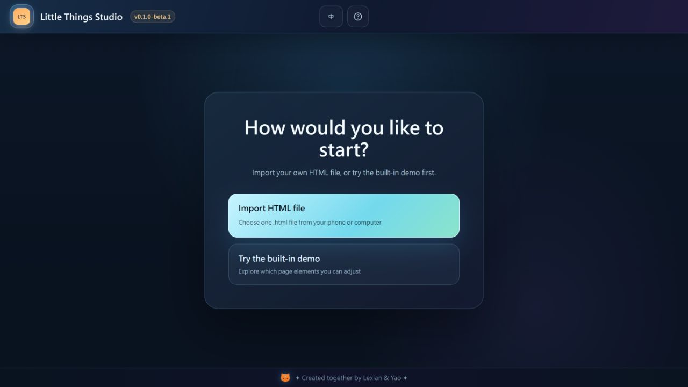

# Little Things Studio

[繁體中文](README.zh-TW.md)

Little Things Studio is a dependency-light, local-first visual editor prototype for learning from and making bounded adjustments to a single self-contained HTML file. The owner-accepted `v0.1.0-beta.1` functional baseline runs entirely in the browser and keeps imported work in a temporary preview session. Its built-in preview uses fictional, generic sample content.

Little Things Studio was created together by Lexian & Yao, with implementation assistance from OpenAI Codex.



Want to use it now? Open the [Little Things Studio live app](https://lexiansy.github.io/little-things-studio/). There is nothing to install and no account is required; the `?` button in the upper-right corner opens the complete guide.

## What this beta can do

- Open the built-in visual editing demo.
- Import a local, single-file `.html` or `.htm` document up to 5 MiB.
- Classify imported elements as `safe`, `view-only`, or `blocked`.
- Adjust approved `safe` elements in a sanitized, in-memory preview: leaf text, font size, text and background colors, width, height, radius, and x/y position.
- Drag and resize approved `safe` elements, with session undo and redo.
- Export an edited HTML copy only when the export safety gate passes, then reopen that copy for another local preview.
- Return to the built-in demo without changing the original imported file.

## Safety model

Imported JavaScript, inline event handlers, forms, navigation, downloads, embedded browsing contexts, and external network resources are blocked or neutralized. The preview iframe does not receive script, form, popup, download, or top-navigation permissions. Imported editing is limited to the sanitized preview copy and its session state. The immutable source string is retained for safe reconstruction; the original file is never overwritten.

See [Import security model](docs/IMPORT_SECURITY_MODEL.md) for the detailed boundaries.

## Important limitations

This beta is not a general-purpose website importer. It does not support arbitrary live websites, framework applications, multi-file projects, PWA or project source, imported JavaScript execution, direct writeback, or editing `view-only` and `blocked` elements. Export is unavailable whenever the candidate cannot prove the bounded safe-edit and source-mapping rules. Unsupported structures are reported instead of being guessed at.

## Start without coding

1. Open the GitHub Pages [live app](https://lexiansy.github.io/little-things-studio/). There is nothing to install and no account is required.
2. On your first visit, open the `?` guide in the upper-right corner or begin with the built-in demo.
3. To edit your own page, prepare one self-contained `.html` or `.htm` file no larger than 5 MiB. A live URL, ZIP, folder, or framework project such as React or Vue cannot be imported directly.
4. Choose **修改 HTML (Edit HTML)** above the workbench and select the file. Studio reads a temporary copy in your browser; it does not upload or overwrite the original.
5. Select elements labelled **editable safe** to change text or appearance. **view-only** elements can only be inspected, and **blocked** means an unsafe or unsupported capability was disabled.
6. When the safety checks pass, choose **下載修改後 HTML (Download edited HTML)** to receive a new `.lts-edited.html` file. Studio does not publish the site for you.

## Run locally (contributors)

The repository has no runtime dependencies and requires no package installation.

```powershell
node scripts/serve.mjs
```

Open <http://127.0.0.1:4174/index.html>. You may also use another static server from the repository root.

Try the fixtures:

- `fixtures/v0.6/simple-static.html` demonstrates editable safe elements and a view-only button.
- `fixtures/v0.6/unsafe-blocked.html` demonstrates blocked scripts, handlers, navigation, forms, and external resources.

## Checks

Node.js 22 or newer is recommended.

```powershell
npm run check
```

The repository has no runtime dependencies and installs no packages. The checks cover the standalone baseline, import sandbox and CSP boundaries, session-only safe editing, safe-copy export, syntax, and public-repository readiness.

## Project status

`v0.1.0-beta.1` is the public beta prerelease, reissued on 2026-08-19 with a generic fictional built-in sample before external adoption. The functional baseline and reissued generic live sample are owner accepted, and release/public readback is complete. It is available from the [GitHub repository](https://github.com/lexiansy/little-things-studio), [release page](https://github.com/lexiansy/little-things-studio/releases/tag/v0.1.0-beta.1), and live demo above. It is not a promise of support for unsupported HTML structures. See [Current status](docs/CURRENT_STATUS.md), [Next steps](docs/NEXT_STEPS.md), and the [roadmap](docs/ROADMAP.md).

## Contributing and security

Please read [CONTRIBUTING.md](CONTRIBUTING.md) before proposing a change. Do not disclose suspected security vulnerabilities in a public issue; follow [SECURITY.md](SECURITY.md).

## License and credits

The project is available under the [MIT License](LICENSE). Project roles and acknowledgements are listed in [CONTRIBUTORS.md](CONTRIBUTORS.md), and public visual assets are documented in [Asset provenance](docs/ASSET_PROVENANCE.md).
